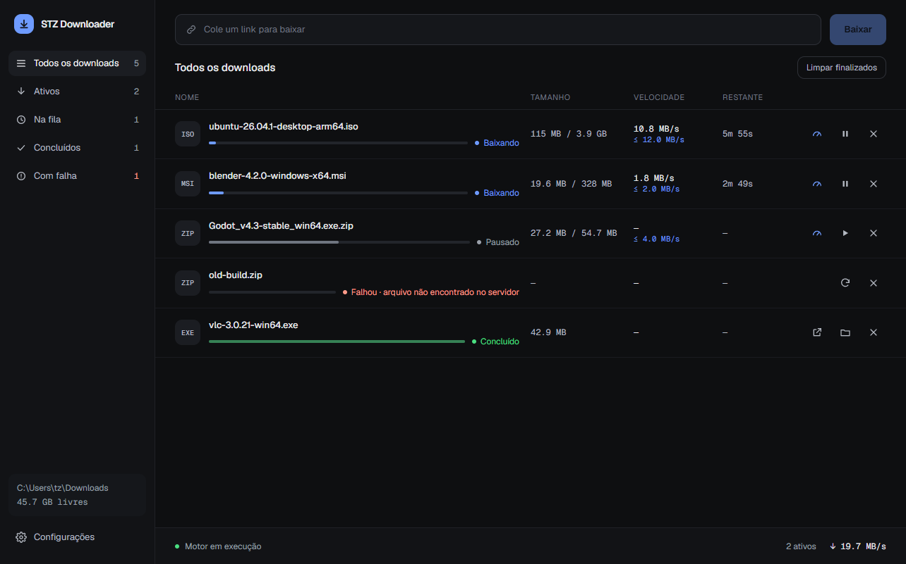

# stz downloader

Um gerenciador de downloads moderno, estilo IDM, com backend em **Python** +
interface em **QML (PySide6)** e o motor de download **aria2**. Inclui uma
extensão de navegador (Manifest V3) que intercepta downloads e os repassa ao
aria2 — a sensação "IDM".



## Instalação

1. Baixe o `-desktop-setup.exe` em [Releases](https://github.com/starzynhobr/stz-downloader/releases/latest).
   A partir da 0.2.0 o app se atualiza sozinho (com verificação SHA-256).
2. Instale a extensão:
   [Firefox Add-ons](https://addons.mozilla.org/pt-BR/firefox/addon/stz-downloader-integration/) ·
   Chrome Web Store (em análise)

O aplicativo permite limitar a velocidade total nas configurações e também
definir um teto individual em cada download. O valor `0` remove o limite; o
limite global é persistido e reaplicado ao iniciar, enquanto limites individuais
acompanham as opções da sessão do aria2.

## Arquitetura

```
Extensão (Chrome/Firefox) ──Native Messaging──► Host nativo
                                                    │ HTTP autenticado
UI QML (PySide6) ──HTTP/WS autenticado──► Bridge FastAPI (porta dinâmica)
                                                    │ JSON-RPC
                                                    ▼
                                          aria2c (subprocesso, :6800)
```

- `src/stz_downloader/aria2/`  — gerência do processo `aria2c` + cliente JSON-RPC
- `src/stz_downloader/server/` — ponte FastAPI (REST + WebSocket) usada pela UI e pela extensão
- `src/stz_downloader/ui/`     — UI em QML e o backend que a alimenta
- `extension/`                 — extensão MV3, sem dependência de porta fixa
- `third_party/aria2/`         — binário do aria2 (GPL, baixado à parte) + licença
- `packaging/msix/`            — empacotamento MSIX self-signed

## Desenvolvimento

```bash
python -m venv .venv && .venv\Scripts\activate
pip install -e ".[dev]"
python scripts/fetch_aria2.py      # baixa aria2c.exe + licença GPL
python -m stz_downloader           # sobe a bridge + UI
python -m stz_downloader --headless  # só a bridge (para testar a extensão)
```

### Extensão

A extensão conversa com `com.stzlabs.downloader`, o Native Messaging host
instalado junto com o aplicativo. Se um download chegar com o aplicativo
fechado, o host o inicia e aguarda a bridge. A bridge prefere a porta 8765 por
compatibilidade, mas reserva automaticamente qualquer porta livre se ela já
estiver ocupada.

O build Windows gera `stz-downloader-native-host.exe` ao lado do aplicativo. O
instalador Inno registra e remove o host automaticamente; builds MSIX fazem o
registro no primeiro início. Para testar uma build congelada sem instalador:

```powershell
.\dist\stz-downloader\stz-downloader-native-host.exe --register
```

Gere os ícones uma vez: `python scripts/generate_icons.py`.

**Firefox / Floorp (Ablaze):**
1. Copie `manifest.firefox.json` por cima de `manifest.json` (o Firefox usa
   `background.scripts`; o Chrome usa `service_worker`):
   ```bash
   cp extension/manifest.firefox.json extension/manifest.json
   ```
   (ou rode `python scripts/build_extension.py firefox`)
2. Abra `about:debugging#/runtime/this-firefox` → **Carregar extensão
   temporária** → selecione qualquer arquivo dentro de `extension/`.
3. Clique no ícone da extensão → **Permissões** → permita acesso a todos os
   sites. No Firefox MV3 as permissões de host são opcionais; sem isso os
   cookies não são repassados e downloads autenticados podem falhar.

> Extensão temporária some ao fechar o navegador. Para fixar, é preciso
> assinar (AMO) ou usar uma build que aceite extensões não assinadas.

**Chrome / Edge / Brave:**
1. Garanta o `manifest.json` na variante Chrome
   (`python scripts/build_extension.py chrome`).
2. `chrome://extensions` → ative **Modo desenvolvedor** → **Carregar sem
   compactar** → selecione a pasta `extension/`.

## Configuração

Os padrões essenciais do aria2 ficam no código para também existirem no app
congelado; preferências de empacotamento ficam em `pyproject.toml`. Sobrescreva
em `%APPDATA%/stz-downloader/config.toml`:

```toml
[aria2]
rpc_port = 6900

[downloads]
directory = "D:/Downloads"
```

`server.port` é somente uma preferência. A porta real é publicada, junto com
um token aleatório de sessão, em
`%LOCALAPPDATA%\stz-downloader\runtime.json`; clientes sem o token são
rejeitados.

## Empacotamento (MSIX self-signed)

```powershell
pip install ".[packaging]"
pyinstaller --noconfirm --windowed --name stz-downloader src/stz_downloader/__main__.py
powershell -ExecutionPolicy Bypass -File packaging/msix/build.ps1
```

O MSIX é assinado com um certificado self-signed. Para instalar em outra
máquina, importe `dist/stz-downloader-dev.cer` em **Trusted People** antes de
abrir o `.msix`.

## Licenças

Código deste projeto: MIT. O binário do **aria2** é GPLv2+ e é usado como
processo externo (mera agregação) — veja `third_party/aria2/SOURCE.md`.
